# Actividad 01. Pokédex con JavaScript

- **Proyecto:** Pokédex de Diego
- **Autor:** Diego Gil
- **Curso:** 2.º DAM · Programación multimedia y dispositivos móviles · 2026/2027
- **Tecnologías:** HTML, CSS y JavaScript sin librerías, [PokéAPI](https://pokeapi.co/), Git y GitHub, Visual Studio Code con Live Server.

Es una Pokédex con los 151 Pokémon de Kanto hecha con HTML, CSS y JavaScript, con los datos de PokéAPI. Parte de la mini-Pokédex de la práctica guiada.

## Cómo ejecutarla

1. Clona el repositorio: `git clone https://github.com/diegoalegil/pgl-2dam.git`
2. Abre la carpeta `1er-trimestre/ut1-fundamentos/actividad-01-pokedex` en Visual Studio Code.
3. Abre `index.html` con Live Server (clic derecho → "Open with Live Server"). Si no la tienes, instala la extensión Live Server en VS Code. Con doble clic no funciona porque `app.js` es un módulo y necesita un servidor.
4. Pulsa "Cargar Pokémon". Hace falta conexión a internet porque los datos vienen de PokéAPI.

## Estructura del proyecto

```text
actividad-01-pokedex/
├── index.html
├── README.md
├── assets/
│   ├── images/
│   │   └── pokeball.png   (cursor de los botones e icono de la pestaña)
│   └── readme/            (capturas de este README)
├── css/
│   └── style.css
└── js/
    ├── app.js             (lo que pasa en la página: carga, tarjetas, filtros y panel)
    └── Pokemon.js         (la clase con los datos que uso de cada Pokémon)
```

## Funcionalidades

- Carga los 151 Pokémon de la primera generación desde PokéAPI, todos a la vez con `Promise.all`.
- Mensajes de estado: listo para empezar, cargando, cargados, sin resultados y error de conexión con botón "Reintentar".
- Una tarjeta por Pokémon con número, nombre, sprite, tipos (cada uno con su color), altura en metros y peso en kilos.
- La tarjeta enseña el sprite de espaldas y al pasar el cursor se da la vuelta.
- Búsqueda por nombre, trozo del nombre o número, mientras escribes o con Enter.
- Filtro por tipo, que se puede usar junto con la búsqueda.
- Panel "Ver detalles" con la imagen oficial, la experiencia base, las habilidades y las estadísticas base.
- Se adapta al móvil.

## 1. Punto de partida

### Qué hacía la mini-Pokédex

Enseñaba un Pokémon cada vez, el que buscabas por nombre o número, con los datos de la API. Si buscabas uno que no existe salía "Pokémon no encontrado.".

### Estructura inicial

```text
actividad-01-pokedex/
├── index.html
├── css/
│   └── style.css
└── js/
    └── app.js
```

Estos tres archivos son los de la guía sin cambiar nada. La versión de la guía la dejé además sin tocar en la carpeta `1er-trimestre/ut1-fundamentos/mini-pokedex`. En el mismo commit añadí el `README.md`, `js/Pokemon.js` (vacío de momento) y la carpeta `assets/images/`, que es la estructura que pide la actividad.

### Funcionalidades que ya estaban

- Buscar un Pokémon por nombre o por número, con el botón o con Enter.
- La búsqueda se normaliza con `trim()` y `toLowerCase()`.
- Si el campo está vacío o solo tiene espacios sale "Introduce un nombre o número.".
- Mientras carga sale "Cargando..." y el botón se desactiva.
- Si no existe sale "Pokémon no encontrado.".
- La tarjeta enseña la imagen oficial, el número con tres cifras (N.º 025), el nombre, la altura en metros, el peso en kilos y los tipos.
- Después de una búsqueda correcta se limpia el campo y vuelve el cursor a él.

### Pruebas antes de empezar

| Entrada | Resultado esperado | ¿Superada? |
|---|---|---|
| `pikachu` | Muestra a Pikachu | Sí |
| `PIKACHU` | Muestra a Pikachu | Sí |
| `   pikachu   ` | Muestra a Pikachu | Sí |
| `25` | Muestra a Pikachu | Sí |
| `charizard` | Muestra dos tipos | Sí |
| `mr-mime` | Muestra a Mr. Mime | Sí, pero sale "Mr-Mime" con guion |
| Campo vacío | Mensaje de validación | Sí |
| Solo espacios | Mensaje de validación | Sí |
| `pokemon-inventado` | Mensaje de Pokémon no encontrado | Sí |

Al buscar uno que no existe sale en la consola una línea roja `GET ... 404 (Not Found)`. No es un error de mi código, es Chrome apuntando que la petición falló. Mi código lo controla con el `catch` y por eso no sale ningún `Uncaught`.

En la consola también me salía un `Uncaught (in promise) Error: Could not establish connection` de `content_script.js`, pero era de una extensión de Chrome y no de mi código. Probando en una ventana de incógnito, que no tiene extensiones, ya no sale.

### Capturas

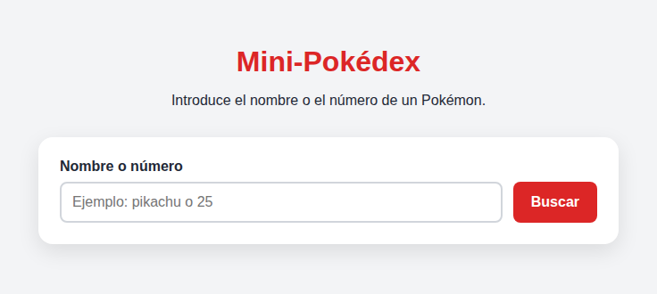

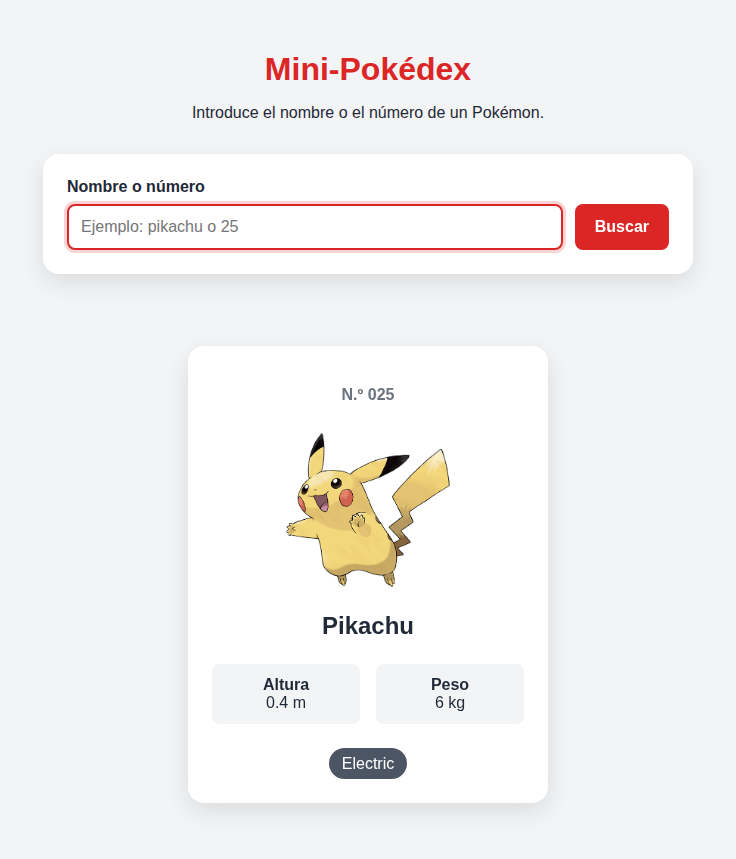

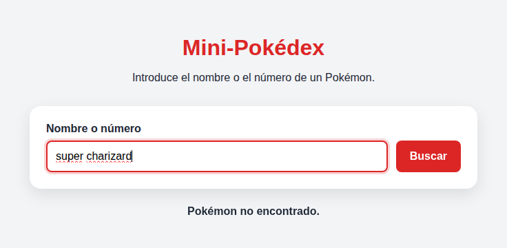

**Commit del punto de partida:** [`72ae29d`](https://github.com/diegoalegil/pgl-2dam/commit/72ae29d0fe63f1a50e799fa49c57e26de100f36d)

## 2. Carga de los 151 Pokémon

### Cambios respecto al código inicial

- En el HTML metí el título y la explicación dentro de un `<header>`, cambié el título a "Pokédex de Diego" y puse una explicación nueva de cómo se usa.
- Añadí el botón "Cargar Pokémon", fuera del formulario y con `type="button"`, y un desplegable `<select>` para filtrar por tipo, de momento solo con la opción "Todos".
- El mensaje ahora empieza con `Pulsa "Cargar Pokémon" para empezar.`
- En el CSS puse la cabecera roja con el título en blanco, el contenedor más ancho (1100 px) para que luego quepan las tarjetas, estilos para el botón nuevo y el desplegable, y una Poké Ball como cursor en los botones. La imagen es la de PokéAPI y está en `assets/images/pokeball.png`.
- Creé la clase `Pokemon` en `js/Pokemon.js` y la importé en `app.js`. Para poder usar `import` tuve que poner `type="module"` en el `<script>` del HTML.
- `obtenerPokemon` ya no devuelve un objeto escrito a mano, devuelve `new Pokemon(datos)`.
- La búsqueda de un solo Pokémon de la guía sigue funcionando igual.

### La clase Pokemon

La API devuelve un objeto enorme (Pikachu trae más de 100 movimientos), así que la clase se queda solo con lo que necesito y ya transformado:

| Atributo | De dónde sale en la API | Qué le hago |
|---|---|---|
| `id` | `id` | Nada |
| `nombre` | `name` | Nada |
| `altura` | `height` | Entre 10, porque viene en decímetros y la quiero en metros |
| `peso` | `weight` | Entre 10, porque viene en hectogramos y lo quiero en kilos |
| `spriteEspalda` | `sprites.back_default` | Nada |
| `spriteFrente` | `sprites.front_default` | Nada |
| `imagenGrande` | `sprites.other["official-artwork"].front_default` | Nada (va con corchetes por el guion) |
| `experienciaBase` | `base_experience` | Nada |
| `tipos` | `types` | Con `map` me quedo solo con el nombre de cada tipo |

Los movimientos y todo lo demás no los guardo porque no los uso.

### Cómo se cargan los 151

Para no pedirlos uno detrás de otro, los pido todos a la vez. En el bucle llamo a `obtenerPokemon(id)` sin `await`, así me da una promesa por cada uno, y luego con `Promise.all` espero a que lleguen todas juntas. `Promise.all` los devuelve en el mismo orden en que los pedí, del 1 al 151.

```javascript
const obtenerListaPokemon = async () => {
  const peticiones = [];

  for (let id = 1; id <= TOTAL_POKEMON; id++) {
    peticiones.push(obtenerPokemon(id));
  }

  const lista = await Promise.all(peticiones);
  return lista;
};
```

Lo comprobé con unos `console.log` temporales: salían 151, el primero era Bulbasaur y el último Mew. Tarda menos de un segundo.

### Mensajes y errores al cargar

- Al pulsar el botón sale "Cargando Pokémon..." y el botón se desactiva para que no se pueda pulsar dos veces.
- Cuando terminan sale "Se han cargado 151 Pokémon." (el número sale de `listaPokemon.length`) y el botón se oculta porque ya no hace falta.
- Si falla la conexión sale "No se han podido cargar los Pokémon. Revisa tu conexión a internet e inténtalo de nuevo." y el botón cambia a "Reintentar". El error técnico solo sale en la consola con `console.error`.
- El botón se vuelve a activar en el `finally`, haya ido bien o mal.

Para probar el error usé Chrome: en la pestaña Red marqué "Inhabilitar caché", puse "Sin conexión" y pulsé el botón sin recargar. Luego volví a "Sin limitación", pulsé "Reintentar" y cargaron los 151.

### Problemas que tuve

- Al guardar el nombre puse `datos.nombre` y salía `undefined`, porque en la API se llama `name`. Con el peso me pasó lo mismo (`datos.peso`) y salía `NaN`. Lo que aprendí: a la izquierda va mi nombre en español y a la derecha el de la API en inglés.
- Me costó sacar la imagen grande porque está muy metida dentro del JSON. Primero copié el camino de la URL de la imagen y no tiene nada que ver con el JSON. Lo saqué abriendo las cajas en la consola y usando corchetes para `official-artwork`.
- Cuando `obtenerPokemon` empezó a devolver la clase se rompió la búsqueda: no salía la imagen y Pikachu medía 0,04 m. Era porque la tarjeta usaba `imagen` (ahora es `imagenGrande`) y volvía a dividir entre 10 lo que la clase ya había dividido.
- Una vez cambié el código y el navegador seguía enseñando el viejo. Era la caché y se arregla recargando con `Cmd + Option + R`.

### Capturas

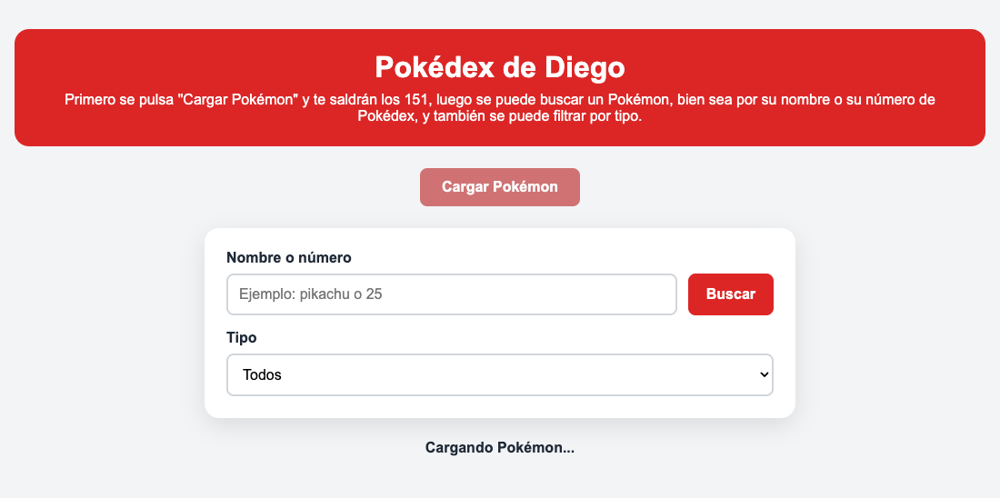

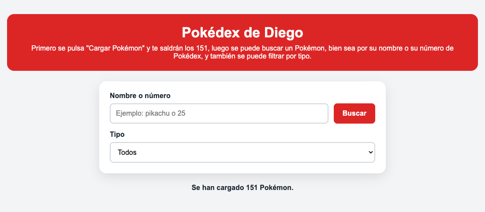

En esta fase todavía no salían las tarjetas. Lo comprobé con el mensaje y con los `console.log` (151, de Bulbasaur a Mew). Las tarjetas se ven en el apartado 3.

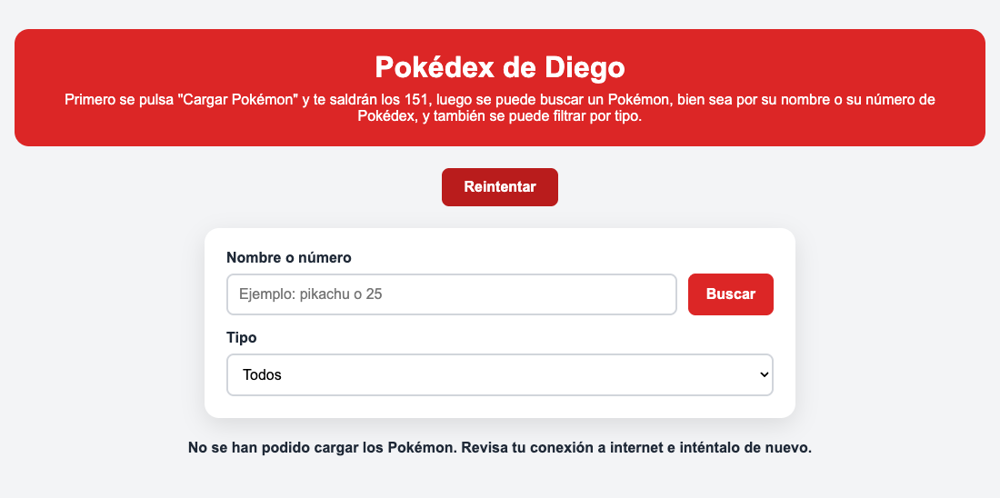

**Commit de la fase:** [`0352db9`](https://github.com/diegoalegil/pgl-2dam/commit/0352db912ad527eaa2121f346ad780f4f33a3ad4)

## 3. Construcción de las tarjetas

### Datos que uso de PokéAPI

Cada tarjeta enseña el número, el nombre, los dos sprites, los tipos, la altura en metros y el peso en kilos. Todo eso ya lo tenía en la clase `Pokemon` desde la fase anterior, así que no he tenido que pedir nada nuevo a la API.

### Cómo se generan las tarjetas

He hecho dos funciones en `app.js`:

- `crearTarjeta(pokemon)` devuelve el HTML de una tarjeta como texto, con una plantilla literal. Es parecida a la `mostrarPokemon` de la guía.
- `mostrarTarjetas(lista)` hace un `map` para crear todas las tarjetas, las une con `join("")` y las mete en la sección `resultado` con `innerHTML`.

```javascript
const mostrarTarjetas = (lista) => {
  resultado.innerHTML = lista.map((pokemon) => crearTarjeta(pokemon)).join("");
};
```

La lista de los 151 la he sacado fuera del botón (`let listaPokemon = [];` arriba del todo) porque en la siguiente fase la necesito también para buscar y filtrar.

Los tipos salen con `map` igual que en la guía, y cada uno lleva una clase con su nombre (`tipo--fire`, `tipo--water`...) para darle un color distinto en el CSS. Para que los nombres se lean bien hice `formatearTexto`, que pone la primera letra en mayúscula y cambia el guion por un espacio. Así "mr-mime" sale como "Mr mime", que era lo que tenía pendiente del apartado 1.

### Cambio de sprite al pasar el cursor

Lo he hecho solo con CSS. Cada tarjeta lleva las dos imágenes, la de espaldas y la de frente, y la de frente está oculta. Cuando pasas el cursor por la tarjeta se cambian:

```css
.tarjeta__sprite--frente {
  display: none;
}

.tarjeta:hover .tarjeta__sprite--espalda {
  display: none;
}

.tarjeta:hover .tarjeta__sprite--frente {
  display: block;
}
```

Así nunca se ven las dos a la vez y no se hace ninguna petición nueva a la API, porque las dos imágenes ya se cargaron al pintar las tarjetas. Lo comprobé en la pestaña Red: al pasar el cursor no aparece ninguna petición.

### Cuadrícula para móvil y ordenador

La sección `resultado` ahora es una cuadrícula con `grid-template-columns: repeat(auto-fill, minmax(150px, 1fr))`. Así caben las columnas que entren según el ancho: 6 en el ordenador y 2 en el móvil, sin que se salga nada por los lados.

### Capturas

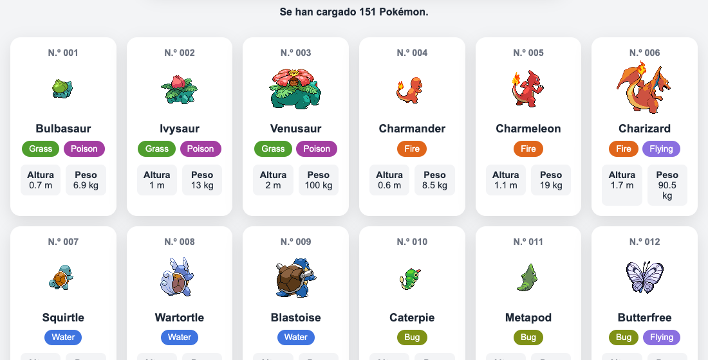

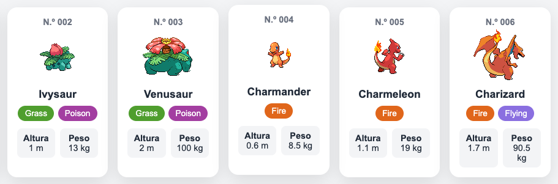

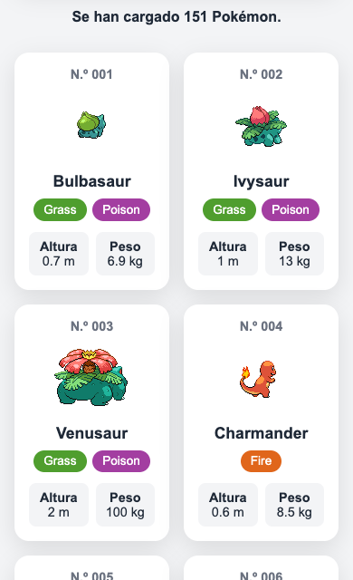

**Commit de la fase:** [`44c62a3`](https://github.com/diegoalegil/pgl-2dam/commit/44c62a3449522d0751a923f040134730e533daf3)

## 4. Barra de búsqueda y filtros

### Cambios respecto a la guía

La búsqueda de la guía preguntaba a la API por un solo Pokémon. Ahora que ya tengo los 151 cargados no hace falta preguntar nada, así que la búsqueda filtra la lista que ya tengo. Por eso he quitado `mostrarPokemon` y el `listener` viejo del formulario, y también los estilos de la tarjeta grande (`.pokemon`).

### Cómo funciona la búsqueda

Todo está en la función `aplicarFiltros`:

1. Coge el texto del buscador con `trim()` y `toLowerCase()`, como en la guía, para que dé igual poner mayúsculas o espacios. También cambio el espacio por un guion, para que "mr mime" encuentre a `mr-mime` (en la tarjeta sale "Mr mime").
2. Con `filter` se queda con los Pokémon que coinciden. Un Pokémon coincide si:
   - el buscador está vacío,
   - o su nombre contiene el texto (`includes`), así funcionan los trozos como "char",
   - o su número es el que he escrito (`pokemon.id === Number(texto)`), así funciona "25" y también "025".
3. Pinta las tarjetas que han quedado con `mostrarTarjetas`.

La búsqueda se hace mientras escribes (evento `input`) y también al pulsar "Buscar" o Enter (evento `submit`, con `preventDefault()` para que no se recargue la página). Si borras todo vuelven a salir los 151.

Si todavía no se han cargado los Pokémon sale "Todavía no hay Pokémon cargados."

### Filtro por tipo

El desplegable se rellena solo al cargar, con la función `rellenarFiltroTipo`. Recorre los 151 y va guardando cada tipo en un array si todavía no estaba (`includes` + `push`). Luego los ordena con `sort()` y crea un `<option>` por cada uno. Así no he escrito la lista de tipos a mano: salen los 17 que hay en los 151.

### Cómo se combinan los dos filtros

En el mismo `filter` compruebo las dos cosas y el Pokémon solo se queda si cumple las dos:

```javascript
const coincideTipo = tipo === "todos" || pokemon.tipos.includes(tipo);

return coincideTexto && coincideTipo;
```

Por ejemplo, "char" con el tipo Flying solo deja a Charizard.

### Mensajes

- Si hay resultados sale cuántos se muestran, por ejemplo "Mostrando 3 de 151 Pokémon.".
- Si no hay ninguno sale "No hay ningún Pokémon que coincida con la búsqueda." y no queda ninguna tarjeta.

### Capturas

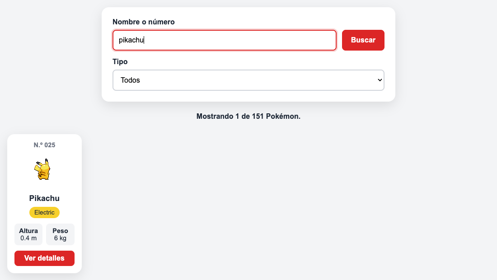

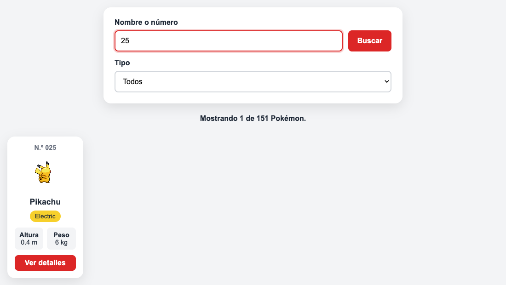

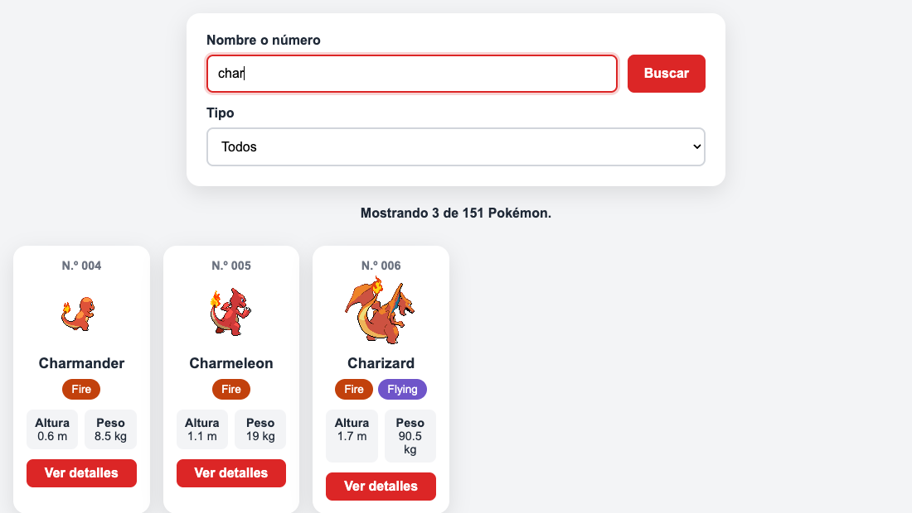

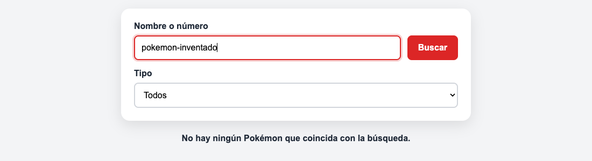

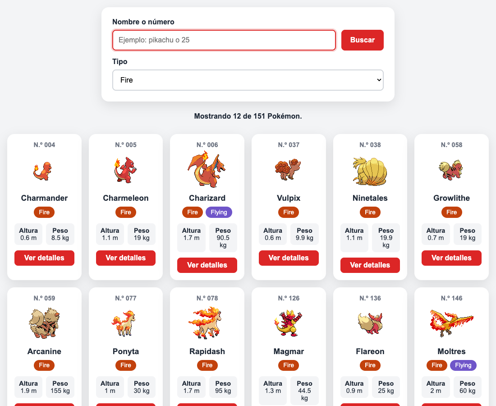

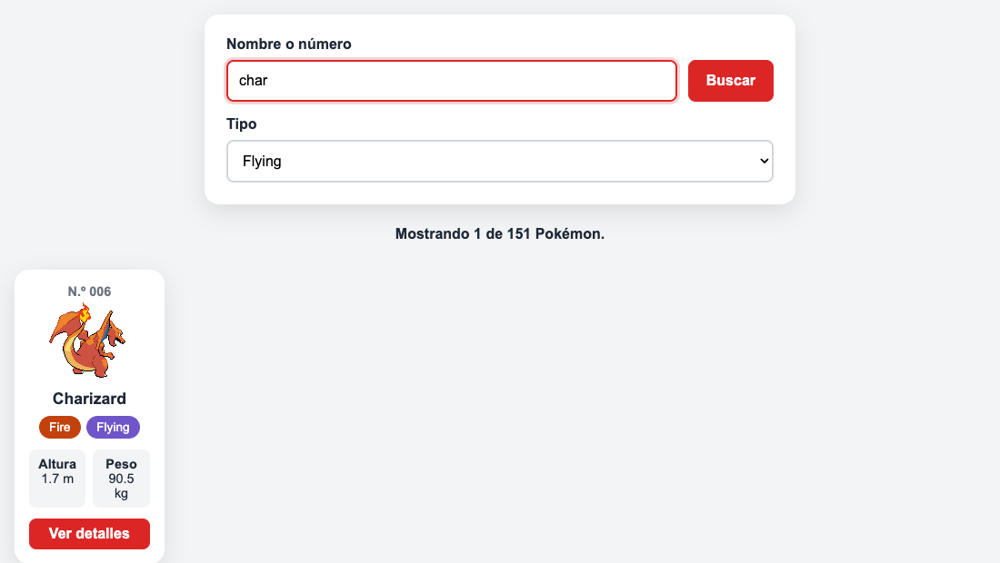

**Commit de la fase:** [`ea07636`](https://github.com/diegoalegil/pgl-2dam/commit/ea076368840e0685ab43729b324585636b43c503)

## 5. Información ampliada

### Datos nuevos en la clase

Para el panel necesitaba dos cosas que todavía no guardaba, así que las añadí a la clase `Pokemon`, otra vez con `map`:

```javascript
this.habilidades = datos.abilities.map((elemento) => elemento.ability.name);
this.estadisticas = datos.stats.map((elemento) => {
  return { nombre: elemento.stat.name, valor: elemento.base_stat };
});
```

En las estadísticas guardo un objeto pequeño con el nombre y el valor de cada una. Como la API las da en inglés (`hp`, `attack`, `special-attack`...), en `app.js` hice un objeto `NOMBRES_ESTADISTICAS` para enseñarlas en español: Puntos de salud, Ataque, Defensa, Ataque especial, Defensa especial y Velocidad.

### El panel

Para el panel he usado la etiqueta `<dialog>` de HTML, que ya sirve para hacer ventanas que se abren encima de la página:

- Cada tarjeta tiene un botón "Ver detalles" con el número del Pokémon guardado en `data-id`.
- Después de pintar las tarjetas, `mostrarTarjetas` le pone un `click` a cada botón. Al pulsarlo, busca el Pokémon en la lista con `find` y llama a `mostrarDetalles`.
- `mostrarDetalles` monta el contenido con una plantilla literal y abre el panel con `showModal()`.

El panel enseña el número, el nombre, la imagen oficial en grande, los tipos, la altura, el peso, la experiencia base, las habilidades y las seis estadísticas base.

Se puede cerrar sin recargar la página de tres formas: con el botón "Cerrar" (`close()`), con la tecla Esc (eso ya lo hace el `<dialog>` solo) o pinchando fuera del panel.

Como los tipos ahora salen en la tarjeta y en el panel, saqué el código que los pinta a una función `crearTiposHTML` para no repetirlo.

### Capturas

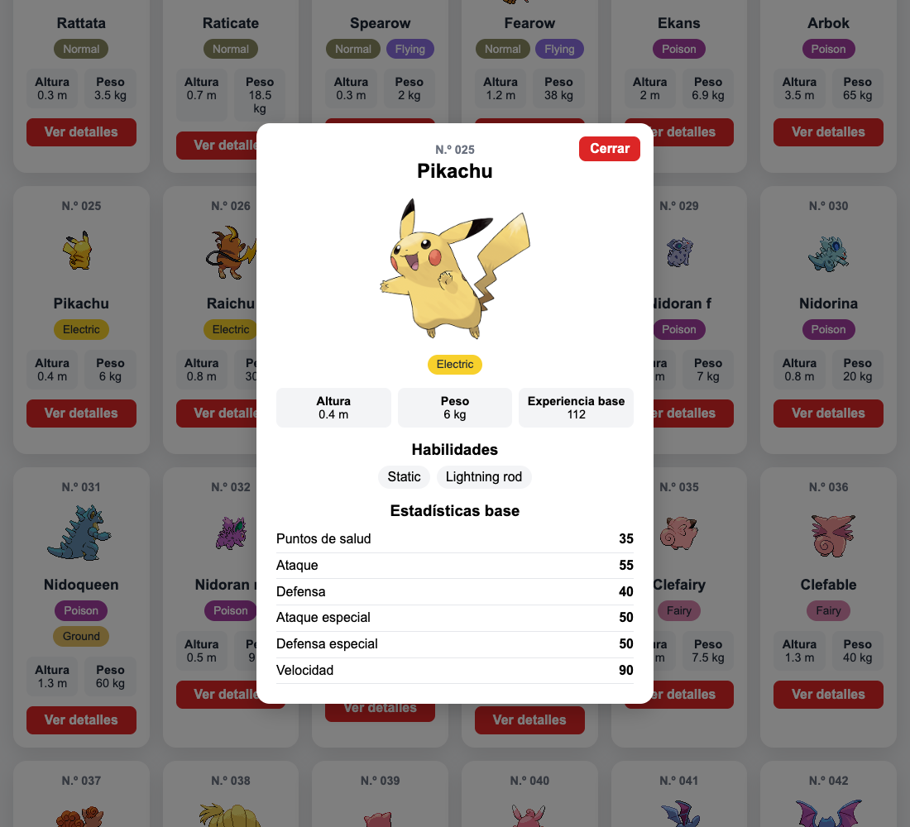

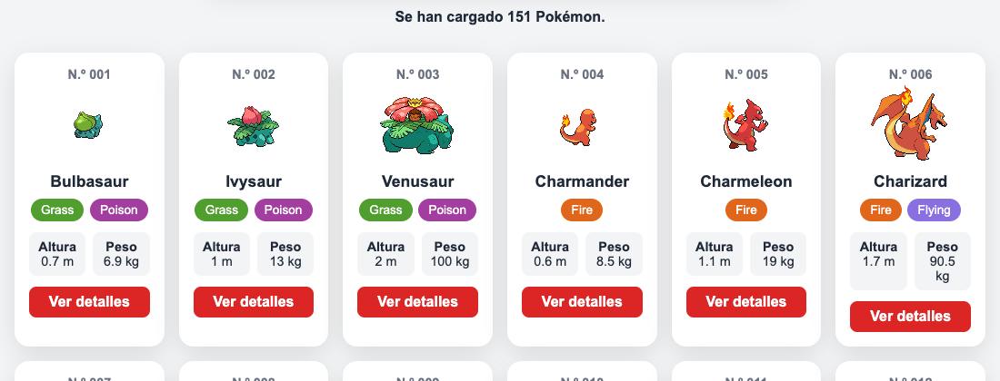

**Commit de la fase:** [`26a15ba`](https://github.com/diegoalegil/pgl-2dam/commit/26a15ba61e1d256fef7c6c246bf84577778dc57a)

## 6. Gestión de estados y errores

La aplicación tiene estos estados y cada uno tiene su mensaje en el párrafo `#mensaje`, que tiene `aria-live="polite"` para que los lectores de pantalla lo lean:

| Estado | Qué sale |
|---|---|
| Preparada para empezar | `Pulsa "Cargar Pokémon" para empezar.` |
| Cargando | "Cargando Pokémon..." y el botón desactivado |
| Cargada | "Se han cargado 151 Pokémon." y el botón desaparece |
| Búsqueda sin resultados | "No hay ningún Pokémon que coincida con la búsqueda." y ninguna tarjeta |
| Error de conexión | "No se han podido cargar los Pokémon. Revisa tu conexión a internet e inténtalo de nuevo." y el botón pasa a "Reintentar" |

Si se busca antes de cargar sale "Todavía no hay Pokémon cargados."

Los errores se recogen con `try` y `catch`. En la página nunca sale el error técnico: el usuario ve una frase que se entiende y el error de verdad (`TypeError: Failed to fetch`) solo sale en la consola con `console.error`. Como el botón se vuelve a activar en el `finally`, la aplicación no se queda bloqueada y se puede reintentar.

Capturas de los estados:


## 7. Pruebas finales

| N.º | Prueba | Resultado esperado | ¿Superada? |
|---|---|---|---|
| 1 | Abrir la aplicación | Se muestra la interfaz inicial sin errores | Sí |
| 2 | Iniciar la carga | Aparece un mensaje de carga | Sí |
| 3 | Finalizar la consulta | Se muestran 151 tarjetas | Sí |
| 4 | Buscar `pikachu` | Solo aparece Pikachu | Sí |
| 5 | Buscar `25` | Solo aparece Pikachu | Sí |
| 6 | Buscar `char` | Aparecen los Pokémon cuyo nombre contiene ese fragmento | Sí (Charmander, Charmeleon y Charizard) |
| 7 | Buscar un nombre inexistente | Se muestra un mensaje sin errores técnicos | Sí |
| 8 | Vaciar la búsqueda | Vuelven a mostrarse todos los Pokémon | Sí |
| 9 | Seleccionar el tipo `fire` | Solo aparecen Pokémon de tipo fuego | Sí (12) |
| 10 | Combinar texto y tipo | Se cumplen simultáneamente ambos filtros | Sí ("char" + Flying solo deja a Charizard) |
| 11 | Colocar el cursor sobre una tarjeta | El sprite cambia de espalda a frente | Sí, y sin ninguna petición nueva |
| 12 | Retirar el cursor | Vuelve a mostrarse el sprite trasero | Sí |
| 13 | Pulsar `Ver detalles` | Aparece toda la información ampliada solicitada | Sí |
| 14 | Cerrar los detalles | El panel desaparece sin recargar la página | Sí (con el botón, con Esc o pinchando fuera) |
| 15 | Simular un fallo de conexión | Aparece un mensaje y se puede reintentar | Sí |
| 16 | Reducir el ancho de la ventana | Las tarjetas se adaptan sin desbordamientos | Sí (6 columnas en el ordenador, 4 en tablet, 2 en el móvil y 1 en pantallas muy pequeñas) |

### Pruebas de la guía después de los cambios

También volví a pasar las pruebas de la práctica guiada. Ahora la búsqueda filtra la colección en vez de preguntar a la API, así que dos cambian a propósito. Además, `mr-mime` ahora sale sin guion por `formatearTexto` (apartado 3):

| Entrada | Antes (guía) | Ahora |
|---|---|---|
| `pikachu`, `PIKACHU`, `   pikachu   `, `25` | Pikachu | Pikachu |
| `charizard` | Dos tipos | Dos tipos |
| `mr-mime` | "Mr-Mime" con guion | "Mr mime" |
| Campo vacío o solo espacios | Aviso "Introduce un nombre o número." | Salen los 151, porque el enunciado pide que al vaciar la búsqueda vuelvan todos |
| `pokemon-inventado` | "Pokémon no encontrado." | "No hay ningún Pokémon que coincida con la búsqueda." |

### Correcciones después de las pruebas

- En la consola salía un error 404 de `favicon.ico` porque la página no tenía icono. Lo arreglé poniendo la Poké Ball como icono de la pestaña y ya no sale ningún error en el uso normal. Commit: [`9d48637`](https://github.com/diegoalegil/pgl-2dam/commit/9d48637b736719f0e4d2c07ec14cec37d590b55e)

Al repasarlo todo encontré algunas cosas más y las arreglé en el commit [`e9d33f8`](https://github.com/diegoalegil/pgl-2dam/commit/e9d33f82dd8044c232c1bf5dbd0f59e863482cc2):

- Buscar "mr mime" o "nidoran f" como sale en la tarjeta no encontraba nada, porque en la API llevan guion. Ahora el espacio se cambia por un guion.
- Si escribías algo antes de cargar, al cargar salían los 151 con el texto todavía en el buscador. Ahora el buscador se vacía al cargar.
- Si buscabas antes de cargar salía `Primero pulsa "Cargar Pokémon".` aunque ya estuviera cargando o hubiera fallado. Ahora sale "Todavía no hay Pokémon cargados.", que vale para todos los casos.
- Con un solo resultado salía "Se muestran 1 de 151 Pokémon.", que suena mal. Ahora sale "Mostrando 1 de 151 Pokémon.".
- En el móvil, si bajabas en el panel de detalles y abrías otro Pokémon, el nuevo salía ya bajado. Ahora siempre se abre arriba (`panelDetalles.scrollTop = 0`).
- Algunos colores de tipo eran muy claros para el texto blanco (fire, grass, water...). Los oscurecí un poco para que se lean mejor.
- La constante `URL_API` no se usaba: `obtenerPokemon` volvía a escribir la URL entera. Ahora la usa.
- Dentro de `obtenerListaPokemon` había una variable que se llamaba igual que la lista de fuera (`listaPokemon`) y liaba al leerlo. La cambié a `lista`.

